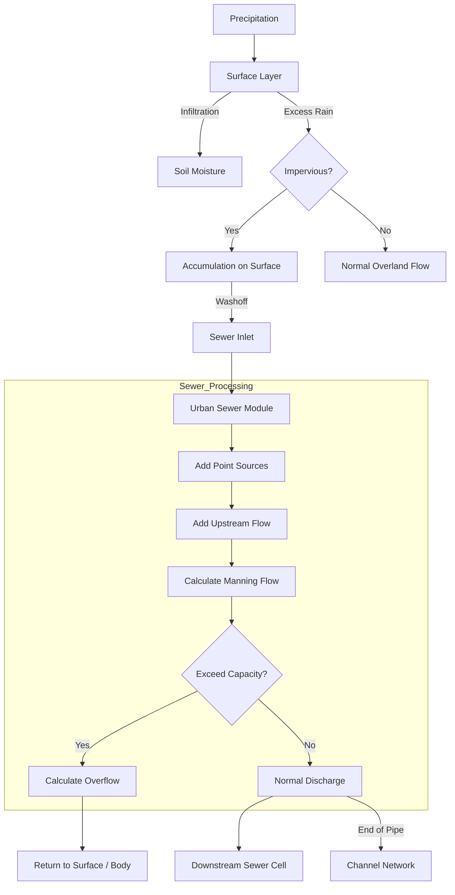

# Technical Report: Urban Sewer Module Design

## 1. Introduction
This design document details the architecture and implementation of a new modules, `module_urban_sewer`, for WRF-Hydro. This module introduces a conceptual urban drainage network layer, enabling the simulation of subsurface conduit flow, combined sewer systems (CSS), pumping stations, and solute transport within urban grid cells.

## 2. Mathematical Framework

### 2.1 Sewer Hydraulic Model (Diffusive Wave)
To accurately simulate backwater effects (where downstream water levels restrict upstream flow), the module utilizes a **Diffusive Wave** approximation. This is an enhancement over the Kinematic Wave model as it includes the pressure gradient term in the momentum equation.

**Discharge Equation:**
The flow rate $Q$ is calculated using the Manning's equation modified for the friction slope $S_f$:
$$ Q = \frac{1}{n} A R^{2/3} \sqrt{|S_f|} \cdot \text{sgn}(S_f) $$

**Friction Slope:**
The friction slope is approximated by the gradient of the water surface elevation (WSE):
$$ S_f = \frac{\text{WSE}_{current} - \text{WSE}_{downstream}}{\Delta x} $$
Where $\text{WSE} = Z_{bed} + h_{water}$.

This formulation allows for:
1.  **Backwater Effects**: Reduced slope $S_f$ decreases discharge when downstream levels are high.
2.  **Reverse Flow**: If $\text{WSE}_{down} > \text{WSE}_{current}$, flow direction reverses (negative $Q$).

**Continuity Equation:**
$$ \frac{V^{t+1} - V^t}{\Delta t} = Q_{in} - Q_{out} - Q_{overflow} $$

### 2.2 Solute Transport Model
The module tracks pollutants using a mass-balance approach coupled with hydrological fluxes.

**Surface Accumulation:**
Pollutants accumulate on impervious surfaces following linear buildup:
$$ \frac{dM_{surf}}{dt} = \text{AccumRate} - \text{Washoff} - \text{Vacuum} $$

**Vacuum Removal:**
$$ M_{surf} \leftarrow M_{surf} \cdot (1 - \eta_{vac}) $$
Where $\eta_{vac}$ is the removal efficiency (e.g., 0.5).

**Washoff Function:**
Washoff is modeled as an exponential decay function of runoff rate, simulating the "first flush" effect:
$$ M_{wash} = M_{surf} \cdot (1 - e^{-k_{wash} \cdot Q_{runoff} \cdot \Delta t}) $$

## 3. Module Architecture (`module_urban_sewer.F90`)

The module is encapsulated in a standalone Fortran 90 file. It interacts with the main model via a global state array.

### 3.1 Data Structures
The `urban_sewer_cell` type is the fundamental unit.

```fortran
type urban_sewer_cell
    ! -- Configuration --
    logical :: is_active
    integer :: sewer_type         ! 1: Combined, 2: Separated
    
    ! -- Geometry & Topology --
    real :: width                 ! [m]
    real :: depth_max             ! [m] Capacity Limit
    real :: slope                 ! [m/m]
    real :: manning_n             ! Roughness (0.013 default)
    real :: z_bed                 ! [m] Bed Elevation
    integer :: i_down, j_down     ! Indices of downstream cell
    real :: dist_down             ! [m] Distance to next cell
    
    ! -- Pumping Station --
    logical :: has_pump
    real :: pump_capacity         ! [m3/s]
    
    ! -- State Variables --
    real :: water_depth           ! [m]
    real :: discharge             ! [m3/s]
    real :: overflow              ! [m3/s] (CSO/SSO volume)
    
    ! -- Solutes --
    real, dimension(4) :: surf_mass   ! [kg] On Street
    real, dimension(4) :: sewer_mass  ! [kg] In Pipe
end type urban_sewer_cell
```

### 3.2 Key Subroutines

#### 3.2.1 `urban_sewer_init`
-   **Purpose**: Allocates memory and establishes network topology.
-   **Logic**:
    1.  Detects urban cells from land cover data.
    2.  **Topology Mapping**: Uses the global flow direction grid (`flow_dir`) to identify `i_down`, `j_down` for each cell.
    3.  **Elevation Setup**: Sets `z_bed` based on surface terrain features (e.g., Terrain Z - 2.0m).
    4.  **Sizing Heuristic**: Determines conduit size based on contributing area.

#### 3.2.2 `urban_sewer_drive`
This is the time-stepping routine called within the routing loop.

**Step 1: Inflow Aggregation**
$$ Q_{in} = Q_{runoff} + Q_{upstream} + Q_{point\_source} $$

**Step 2: Hydraulic Solve (Diffusive Wave)**
1.  Compute Water Surface Elevation: $\text{WSE} = Z_{bed} + h$.
2.  Get Downstream WSE from neighbor $(i_{down}, j_{down})$.
3.  Calculate Slope: $S_f = (\text{WSE} - \text{WSE}_{down}) / \text{Dist}$.
4.  Calculate Discharge $Q_{out}$ using Manning's equation with $S_f$.
    -   If $S_f < 0$, $Q_{out}$ is negative (reverse flow).
5.  **Capacity Check**:
    -   Calculate max capacity using conduit geometry.
    -   If $h > D_{max}$, handle surcharge/overflow.

**Step 3: Mass Balance Update**
Update volume and calculate new water depth:
$$ V^{new} = V^{old} + (Q_{in} - Q_{out} - Q_{overflow}) \cdot dt $$

**Step 3: Mass Balance Update**
Update volume and calculate new water depth:
$$ V^{new} = V^{old} + (Q_{in} - Q_{out} - Q_{over}) \cdot dt $$

**Step 4: Solute Transport**
Assuming Classical Mixing Routine (CSTR - Continuous Stirred Tank Reactor) for the segment:
$$ C_{sewer} = \frac{M_{sewer}}{V_{water}} $$
$$ \text{Flux}_{out} = C_{sewer} \cdot Q_{out} $$
This allows concentration pulses to propagate downstream.

## 4. Integration Strategy

To integrate this module into WRF-Hydro 5.4.0:

1.  **Placement**: The call to `urban_sewer_drive` should be placed inside `module_RT.F90`, specifically after the `ROUTE_OVERLAND` call.
2.  **Output Coupling**:
    -   **Overflows**: The calculated `overflow` variable represents CSO/SSO volumes. This flux should be added back to the Surface Runoff (`surface_water_head_routing`) for the *next* timestep, effectively simulating street flooding from surcharged manholes.
    -   **Discharge**: The end-of-pipe discharge (from cells with no downstream sewer receiver) is added as lateral inflow to the Channel Routing module (`q_lateral`).

## 5. Flow Diagram



This design ensures that urban pollution dynamics and hydraulic constraints (pumps/pipes) are physically represented, addressing the primary limitations of the default WRF-Hydro implementation.
